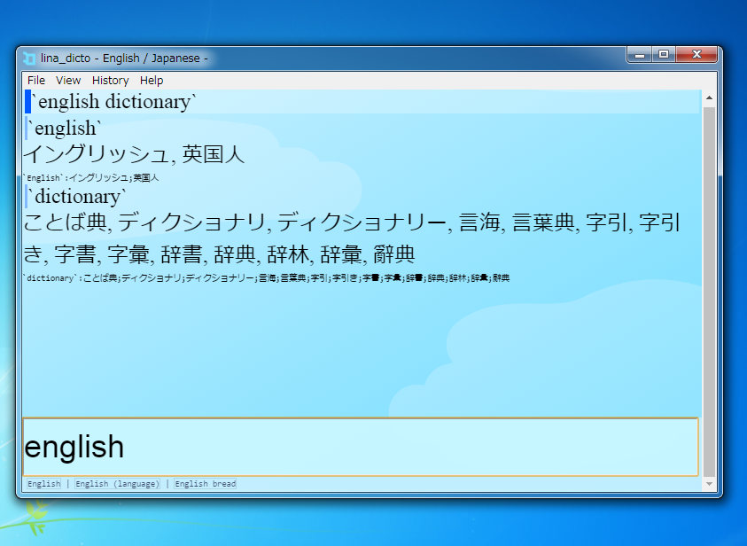
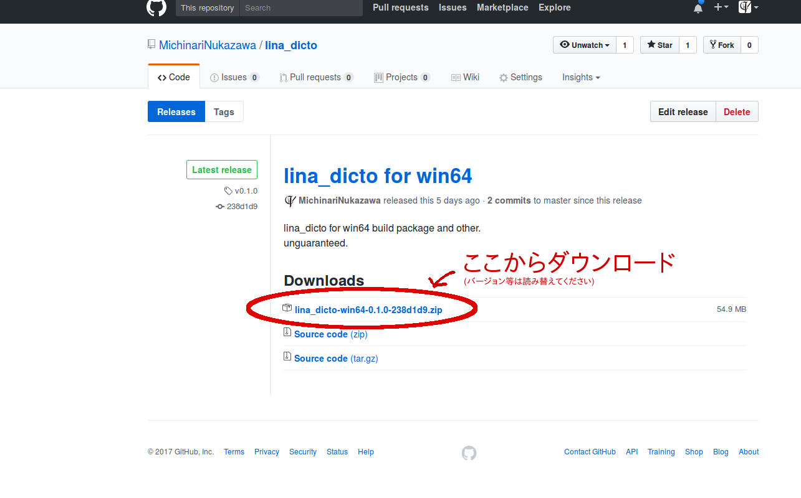

lina\_dicto\_english
====
\- Dictionary for Japanese / English \-

# About
lina\_dicto\_english は日本語/English変換を検索できる辞書アプリケーションです。  

Esperanto辞書 [lina\_dicto](https://github.com/MichinariNukazawa/lina_dicto) の英語版でもあります。  

# Screenshot/Image
  

## アプリケーションの特徴
- アプリケーション画面上で過去の検索結果が簡単に確認できる、タイムライン風のUI
- ユーザの英和・和英辞書検索を助ける機能を複数搭載
  - 入力中に単語の候補を表示する「インクリメンタルサーチ」
  - スペルミスに対して英単語の候補を自動で推定する「もしかして機能」
  - 英文を入れると、自動で単語ごとに分割して検索してくれる「文章検索」
  - 和英検索でヒットしなかった際に、入力と部分一致する日本語の単語を候補として示す「候補推定」
  - 入力補助リンク (インクリメンタルサーチ・もしかして機能などによる単語は、表示がリンクボタンとなっており、クリックで一発入力できる)
  - 検索がヒットしなかった場合に、ブラウザでgoogle translateを開くリンクを提示 (フォールバック機能)
- 検索履歴
  - 検索履歴をファイルへ自動保存(簡易統計機能あり)

# Get luna\_dicto\_english
[Download for latest release](https://github.com/MichinariNukazawa/lina_dicto_english/releases)  

  

# Build
depend builded `../lina_dicto`  
`make run`  

## Package
`make package`  

# License
Clause-2 BSD License  
Exclude dictionary data.(辞書ファイルは辞書ファイル毎のライセンスに準じます)  

## 辞書データについて
外部の辞書データを改変し収録させて頂きました。感謝いたします。  
[辞書データのREADME](dictionary/english/README.md)参照。  

# Contact
mail: [michinari.nukazawa@gmail.com](mailto:michinari.nukazawa@gmail.com)  
twitter: [@MNukazawa](https://twitter.com/MNukazawa)  

Develop by Michinari.Nukazawa, in project "[daisy bell](https://daisy-bell.booth.pm/)".  

